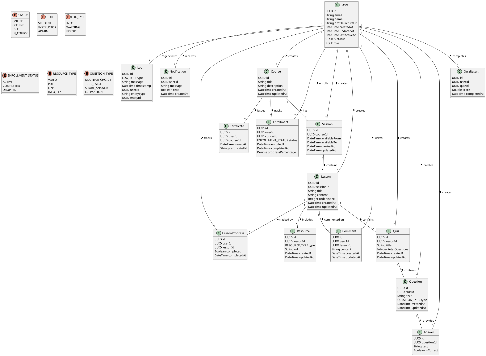

# Application Overview

This document provides an overview of the application, including its purpose, key features, and architecture.

## Purpose

The application is designed to help users learn and practice skills, topics and school subjects. It provides a platform for users to access educational content, track their progress, and engage with interactive learning materials.

## Key Features

- **Own Landing Page**: Users have a personalized landing page where they can access their courses, track their progress, and receive recommendations based on their interests and learning history.
- **Course Catalog**: A comprehensive catalog of courses covering a wide range of subjects and skills, allowing users to find content that matches their learning goals.
- **Progress Tracking**: Users can track their progress through courses, see their achievements, and receive feedback on their performance.
- **Interactive Learning Materials**: The application includes interactive quizzes, exercises, and multimedia content to enhance the learning experience and keep users engaged.
- **Community Features**: Users can connect with other learners, participate in discussions, and share their learning experiences.

**Later on:**

- **Personal AI Tutor**: An AI-powered tutor that provides personalized guidance, answers questions, and offers support to users as they navigate their learning journey.
- **Gamification Elements**: Incorporating gamification features such as badges, leaderboards, and rewards to motivate users and make learning more enjoyable.

## Architecture

This is a short overview which classes and components exist in the application and how they interact with each other. Notice, that the user doesn't has any saved password, because we will use OAuth 2.0 in our Application - connected with: Google and Microsoft.

