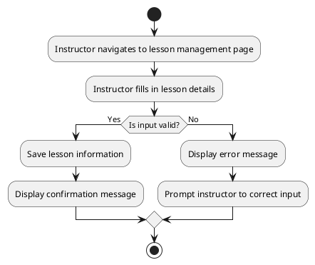

# UC: Lesson Management

## Beschreibung

Instructors can create and manage lessons within sessions. This includes adding content, resources, and setting the lesson order.

## Akteur(e)

* Primärer Akteur: Instructor

## Vorbedingung(en)

* The instructor must be logged in.
* A session must exist.

## Nachbedingung(en)

* The lesson is created or updated successfully.

## Trigger(s)

* The instructor initiates lesson creation or update.

## Normaler Ablauf:

1. The instructor navigates to the lesson management page.
2. The instructor fills in the lesson details.
3. The system validates the input.
4. The system saves the lesson information.
5. A confirmation message is displayed.

## Alternative Abläufe:

3.1 If the input is invalid, an error message is displayed, and the instructor is prompted to correct the input.

## UML Aktivitätsdiagramm

