# Use Case Overview

This document provides an overview of all use cases for the application. Each use case is detailed in its own file within this directory.

## List of Use Cases

1. [UC: User Management](user-management.md)
2. [UC: Course Management](course-management.md)
3. [UC: Session Management](session-management.md)
4. [UC: Lesson Management](lesson-management.md)
5. [UC: Quiz Management](quiz-management.md)
6. [UC: Progress Tracking](progress-tracking.md)
7. [UC: Certificate Issuance](certificate-issuance.md)
8. [UC: Notifications](notifications.md)
9. [UC: Comments](comments.md)

## UML Diagram

The following diagram summarizes all use cases and groups them by business areas:

```plantuml
@startuml
package "Learning Application" {
    package "User Management" {
    usecase "Register/Login" as UC1
    usecase "Manage Profile" as UC2
    }

    package "Course Management" {
    usecase "Create Course" as UC3
    usecase "Update Course" as UC4
    }

    package "Session Management" {
    usecase "Add Session" as UC5
    usecase "Update Session" as UC6
    }

    package "Lesson Management" {
    usecase "Create Lesson" as UC7
    usecase "Update Lesson" as UC8
    }

    package "Quiz Management" {
    usecase "Create Quiz" as UC9
    usecase "Manage Questions" as UC10
    }

    package "Progress Tracking" {
    usecase "Track Lesson Progress" as UC11
    usecase "Track Quiz Progress" as UC12
    }

    package "Certificate Issuance" {
    usecase "Generate Certificate" as UC13
    }

    package "Notifications" {
    usecase "Send Notifications" as UC14
    }

    package "Comments" {
    usecase "Add Comments" as UC15
    }
}

actor "User" as A1
actor "Instructor" as A2

A1 --> UC1
A1 --> UC2
A2 --> UC3
A2 --> UC4
A2 --> UC5
A2 --> UC6
A2 --> UC7
A2 --> UC8
A2 --> UC9
A2 --> UC10
A1 --> UC11
A1 --> UC12
A1 --> UC13
A1 --> UC14
A1 --> UC15
@enduml
```

