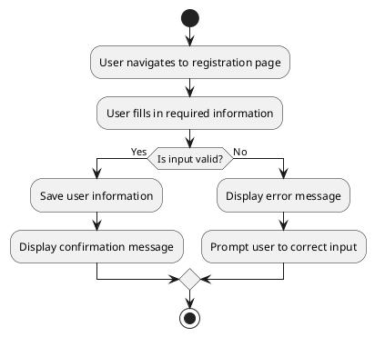

# UC: User Management

## Beschreibung

Users can register, log in, and manage their profiles. This includes updating personal information, profile pictures, and managing account settings.

## Akteur(e)

* Primärer Akteur: User

## Vorbedingung(en)

* The user must have a valid email address.

## Nachbedingung(en)

* The user profile is updated or created successfully.

## Trigger(s)

* The user initiates registration or profile update.

## Normaler Ablauf:

1. The user navigates to the registration or profile page.
2. The user fills in the required information.
3. The system validates the input.
4. The system saves the user information.
5. A confirmation message is displayed.

## Alternative Abläufe:

3.1 If the input is invalid, an error message is displayed, and the user is prompted to correct the input.

## UML Aktivitätsdiagramm

